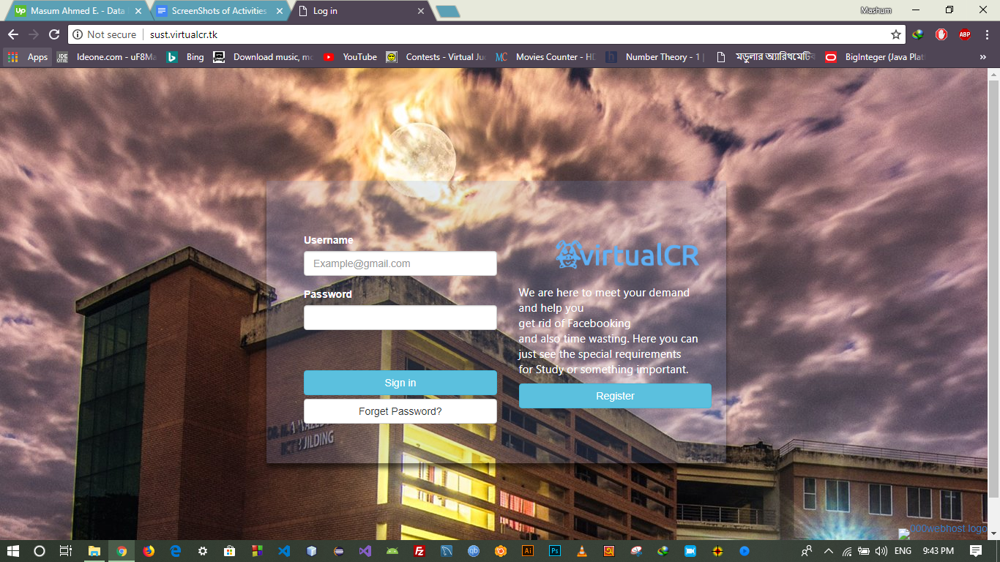

# project150_virtualcrWebsite

I, Masum Ahmed, here launch my first project, project150. This project was made when I was in first year second semester. In this project, I used html, css, javascript, database, phpMyAdmin, php for registration page. That's it.

website_link:  <a href="http://sust.virtualcr.tk/"> virtualCR </a>
 Some Screenshots: 

 

 

Computer Science and Engineering,  
Shahjalal University of Science and Technology (SUST),  
3114, University Ave, Sylhet. 