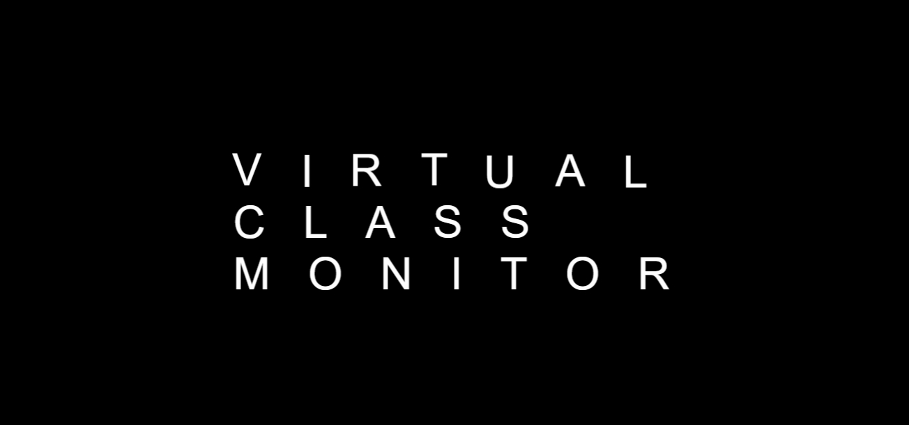
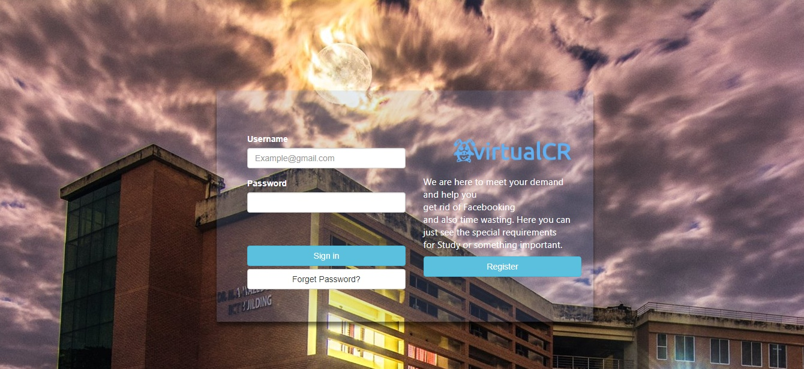
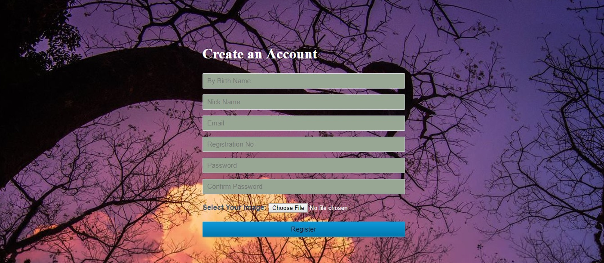
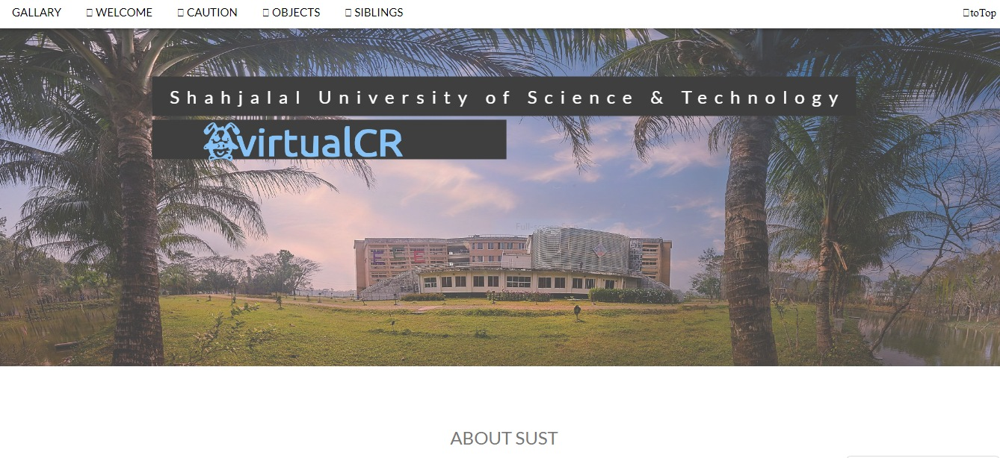
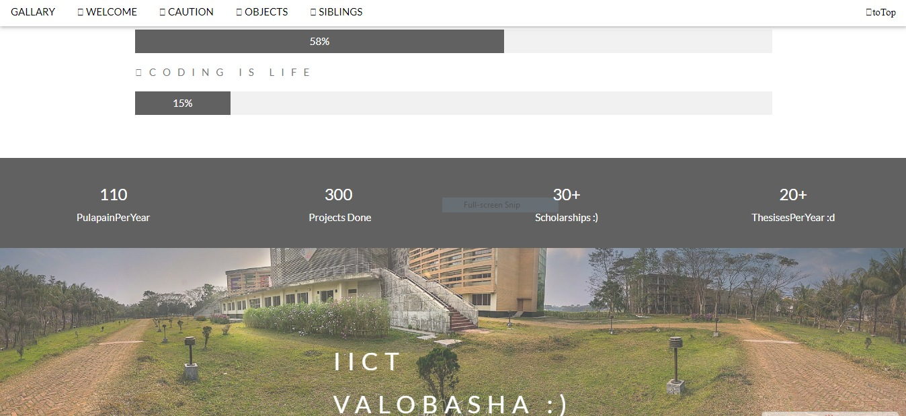
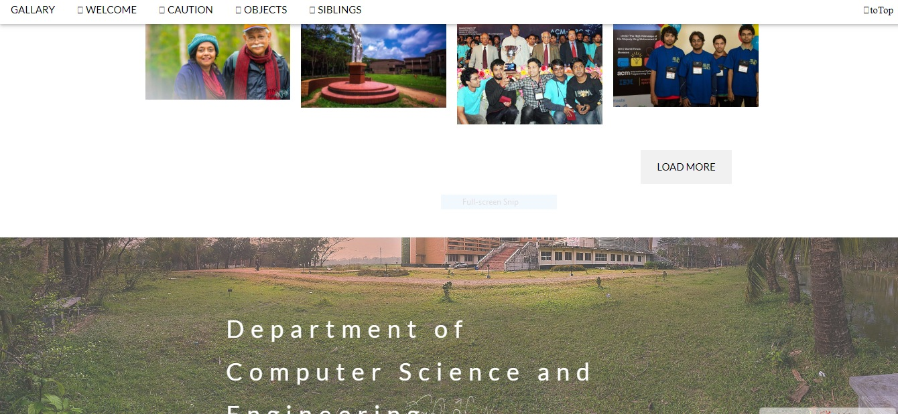
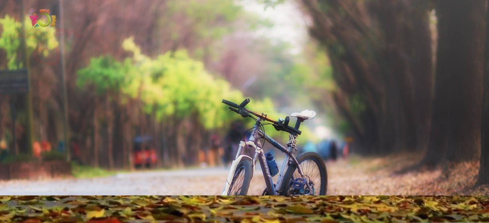

# project150_virtualcrWebsite

I, Masum Ahmed, here launch my first project, project150. This project was made when I was in first year second semester. In this project, I used html, css, javascript, database, phpMyAdmin, php for registration page. That's it.
  
website_link <a href="http://sust.virtualcr.tk/">  virtualCR </a>
 
 
<b><h3>Some Screenshots</h3></b> 

 Hey Welcome! 

 

 Login Page 

 

 Registration Page 

 

 Mother Page (Up) 

 

 Mother Page (Middle) 

 

 Mother Page (End) 

 

 Gallery of SUST  All Credit goes to Anjan Vai

 
Computer Science and Engineering  
Shahjalal University of Science and Technology (SUST)  
3114, University Ave, Sylhet. 